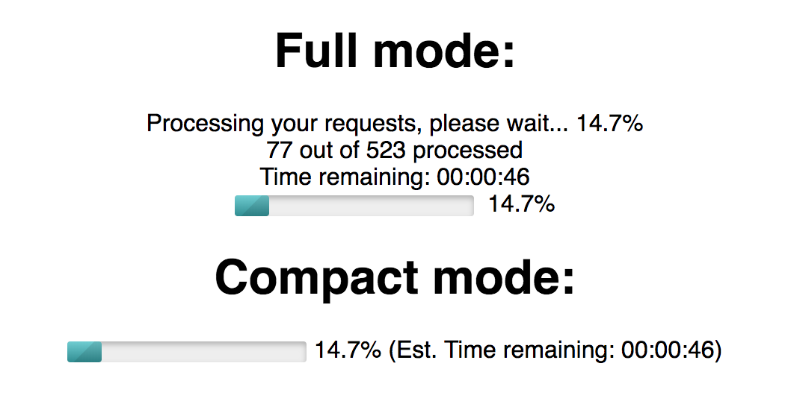
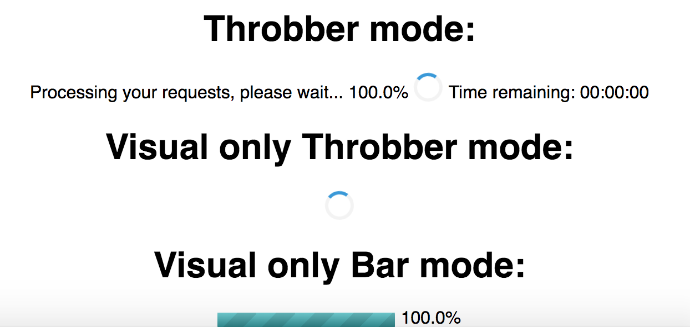

# React-loading-progress

Simple react JS Progress / Loading bar for multiple files

# Description

React loading component with progress bar, percentage and time estimated for the operation to be completed.

How it looks:


It has two options the compact mode, that shows the progress bar, percentage and time left in a single line, and the full mode which outputs in different lines how much items has processed, the current percentage, the progress bar and the estimated time to complete the current operation.


You can now opt for two more options:
1. Having a spinner instead of a progress bar 
2. Showing just the spinner and progress bar without any text



**How to thank me?**
Just click on ⭐️ button :)

# Installation

Install it from npm and include it in your React build process (using Webpack, Browserify, etc).

```
npm i react-js-loading-progress-bar
```


# Usage

Import `LoadingProgress` in your react component.

```
import LoadingProgress from 'react-js-loading-progress-bar';
```

Props available:

| Name        | Type            | Mandatory | Description  
| ------------- |:-------------:| -----:|:-----|
| total      | integer | Y |The total items you are going to process |
| active      | boolean   | Y   |   If you want to activate the loading component |
| current | integer     | Y|   The current item being processed |
| showCompact | present?   |N  |   If you want the single line version (full by default) |
| title | String   |N  |   Render custom title |
| hideProcessingRequest | present?   |N  |   Render processing request in full mode |
| hideTimeRemaining | present?   |N  |   Render time remaining in full mode |
| hideProgressBar | present?   |N  |   Hide entirely the progress bar or spinner |
| hideQtyProcessed | present?   |N  |  Hide the amount of items processed |
| useSpinner | present?   |N  |  changes the progress bar with a spinner (throbber) |
| visualOnly | present?   |N  |  Shows only the progress bar or throbber (depending on the mode you are using) |


For example:
```javascript
 <LoadingProgress
  active={true}
  total={this.state.total}
  current={this.state.current}
  showCompact       
/>
```

To use the spinner instead of the progress bar you can use the useSpinner prop as follows:

```javascript
<LoadingProgress
  useSpinner
  active={true}
  total={this.state.total}
  current={this.state.current}
/>
```

# License 

Licensed under the MIT License © [jciccio](https://www.npmjs.com/~jciccio)
